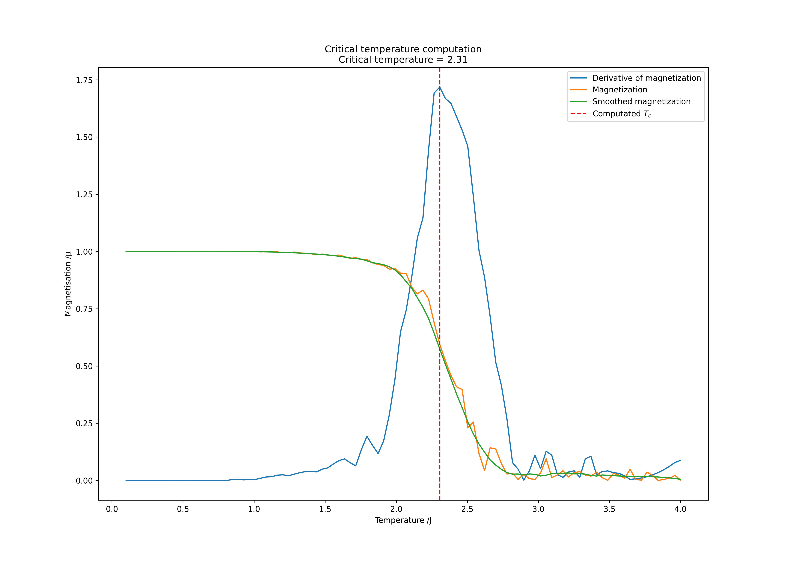
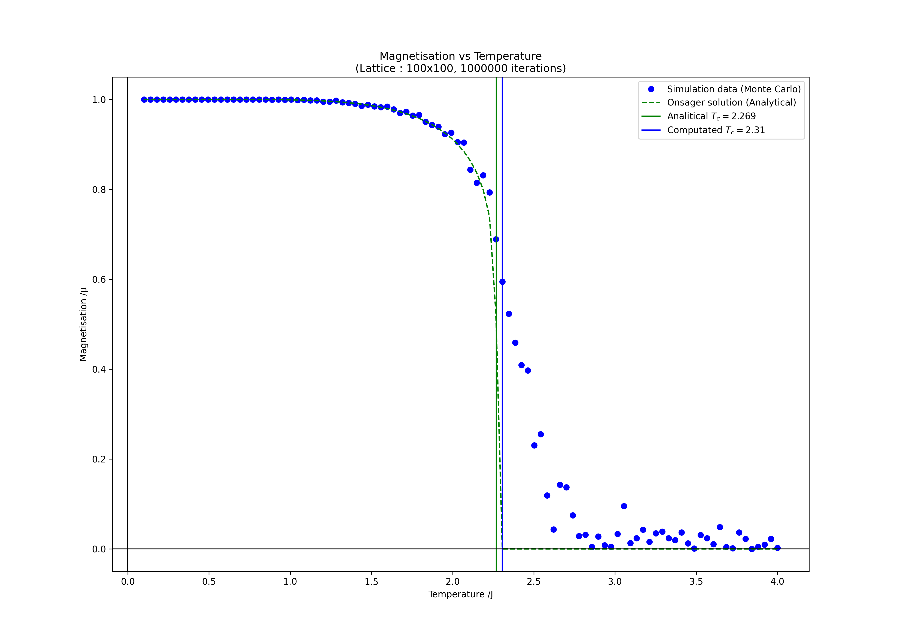

# M1 Project : Ising Model from Monte Carlo Simulation


## Introduction

The Ising model is a mathematical model of ferromagnetism in statistical mechanics. The model consists of discrete variables that represent magnetic dipole moments of atomic spins that can be in one of two states (+1 or -1). The spins are arranged in a lattice, allowing each spin to interact with its neighbors. The model allows the identification of phase transitions, as well as the behavior of the system at different temperatures.

## Objective

The objective of this project is to simulate the Ising model using the Monte Carlo method. The Monte Carlo method is a statistical method that uses random sampling to solve problems. The method is widely used in physics, chemistry, and mathematics to solve problems that might be deterministic in principle but are intractable in practice. The Monte Carlo method is particularly useful for simulating the behavior of complex systems, such as the Ising model.

From this project, we will firstly simulate a 2D Ising model using the Metropolis algorithm. Then, we will extend the simulation to a 3D Ising model. Finally, we will analyze the behavior of the system at different temperatures and identify the phase transition.

## Method

blabla

## Results




## Installation

This project requires Python 3.7 or later.

To get the project, you can clone the repository from GitHub:

```bash
git clone
cd projet_m1/
```

If needed, you can create a virtual environment using venv:
### Linux
```bash 
python -m venv venv
source venv/bin/activate
```
### Windows
```bash 
python -m venv venv
venv\Scripts\activate
```

Then, you can install the required packages using pip:

```bash
pip install -r requirements.txt
```

## Configuration

You can change the configuration of the simulation by changing the constants.py file.

## Usage

To run the project, you can use the following command:

```bash
python main.py
```

